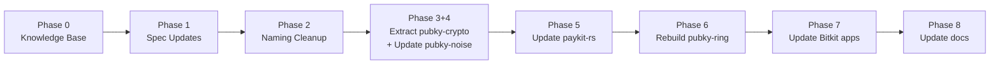

# Response to Antoine's Review

Hi Antoine,

Thank you for the thorough review. We've gone through every theme you raised, verified against the codebase, and built an actionable plan. Here's where we landed on each point.

---

## 1. pubky-crypto Extraction — Agreed, with one scope correction

We're fully aligned on extracting pure crypto primitives into `pubky-crypto`. The modules moving are:

- `kdf.rs` — X25519 derivation, noise seed derivation
- `sealed_blob.rs` + `sealed_blob_v2.rs` — SB2 wire format, AEAD, CBOR encoding
- `ukd.rs` — AppCert, KeyBinding, typed signing
- `secure_mem.rs` — mlock/LockedBytes (feature-gated)
- `ed25519_sign` / `ed25519_verify` — pure crypto helpers currently in `identity_payload.rs`

~4,000 lines total, all with their inline tests.

**The correction**: async-messaging primitives (storage_queue, handshake_queue, session_manager, mobile_manager, datalink_adapter) will **not** move into `pubky-crypto`. These are transport-layer concerns and stay in `pubky-noise`. `pubky-crypto` is strictly pure crypto with zero network or async dependencies.

**Error type split**: We'll create a `CryptoError` enum in `pubky-crypto` with crypto-only variants (KeyDerivation, Serde, InvalidPeerKey, Decryption, InvalidSignature). `NoiseError` stays in `pubky-noise` and gains `From<CryptoError>`. This keeps the error hierarchy clean and avoids leaking transport concerns into the crypto layer.

`pubky-noise` will re-export all moved symbols at their current paths, so downstream consumers (paykit-rs, pubky-ring, bitkit apps) see **zero breakage** initially. Over time they'll migrate to `pubky_crypto::` directly.

---

## 2. Naming Cleanup — Executing all renames

Fully agreed. These renames will be executed atomically:

| Old | New |
|-----|-----|
| `AuthenticatedTransport` | `HomeserverSessionStorage` |
| `UnauthenticatedTransportRead` | `HomeserverPublicStorageRead` |
| `SUPPORTED_SNAPSHOT_PATH` | `SUPPORTED_METHODS_INDEX_PATH` |

This touches ~40 references across paykit-rs (6 sub-crates), plus `AtomicityAuthenticatedTransport` in the Atomicity Specification, and doc comments in atomicity-core. We've mapped every occurrence.

This is a breaking change. paykit-lib gets a major version bump.

---

## 3. Ring ↔ App Communication Interface — Adding spec section

You're right that this was under-specified. We'll add **§13: Ring Transport Abstraction** to PUBKY_CRYPTO_SPEC, covering:

- **Transport-agnostic interface**: bytes-in/bytes-out, C-compatible, portable (as you suggested — "the most C-like and portative")
- **MVP topology**: Same-device (deep links) + cross-device (HTTP relay per AUTH.md)
- **Future topologies**: USB, BLE, Wi-Fi Direct — documented as interface requirements but deferred
- **Open question**: Whether Ring↔Bitkit same-user cross-device uses Noise — we're deferring this decision

The current relay flow (AUTH.md) becomes the normative MVP implementation. The spec will describe the abstract interface so that future transports (hardware Ring, desktop Ring) can plug in without protocol changes.

---

## 4. ContextId & Traffic Analysis — Acknowledged, MVP stays simple

You correctly identified the metadata leakage: `context_id` in storage paths (`/pub/paykit.app/v0/requests/{context_id}/`) reveals communication patterns.

**MVP decision**: Keep current structure (one inbox/outbox per contextId). The polling simplicity matters for mobile.

**Spec action**: We'll add §7.7.1 documenting this limitation explicitly, with a note on the "single inbox" design as future work — where contextId moves inside the encrypted envelope and the path becomes opaque.

**ContextId ownership**: You said "all what is ContextId shouldn't be in paykit." We agree in principle, but for now it stays in paykit-lib (`protocol/scope.rs`). The generation is application-level (random or SHA256 of sorted pubkeys), not pure crypto. We'll tag it in the spec as "may move in future revision" once the namespace stabilizes.

---

## 5. Connection State Machine — Documented as target architecture

Your layered architecture proposal makes a lot of sense:

```
Subscribers (Paykit, Atomicity)
─────────────────────────────
Connection State Machine (ack, ordering, reconnection)
─────────────────────────────
Noise Stack (single channel per PKARR pubkey)
```

Benefits are clear: shared `snow` state reduces mobile memory overhead, unified message ordering, single reconnection path.

**Decision**: We'll document this as the **non-normative target architecture** in the spec (§12.2). Implementation is deferred to post-MVP. For now, each subscriber (Paykit, Atomicity) manages its own Noise sessions independently.

We also noted your suggestion to extract `rate_limit.rs` and `metrics.rs` from paykit-interactive into a shared crate. Documenting as planned future work, but deferring the code change.

---

## 6. Transport Architecture — auth_server-then-noise is normative MVP

We'll add **§14: Transport Architecture** with a decision matrix:

| Model | MVP? | Rationale |
|-------|------|-----------|
| auth_server + SB2 stored delivery | ✅ | Works on mobile, homeserver handles availability |
| Direct P2P noise | ❌ | Mobile IP instability, NAT traversal |
| noise-then-auth-then-noise | ❌ | Ideal long-term, but complex for MVP |

Your analysis on why direct P2P is impractical for mobile is compelling and we'll reference it. The current approach — homeserver-authenticated session + Sealed Blob v2 for stored async delivery + optional live Noise for interactive — becomes the normative stack.

We're also adding your "data remanence" argument and the BIP32 prefix precedent to §11 Security Considerations, as motivation for why the crypto module separation matters beyond just code organization.

---

## 7. Subscription Nonces — Derivable from seed

You flagged that paykit-subscriptions has its own nonce cache that would be lost on crash. Agreed — nonces should be **derivable from the Ring root secret**, not cached independently.

**Action**: We'll review the nonce management in paykit-subscriptions during Phase 5. If they're standalone random nonces, we'll convert to HKDF-derived nonces (seed + counter). This may require a new KDF function in pubky-crypto.

The principle you stated is right: crash recovery should reconstruct state from the seed, not depend on a cache that might be lost. We'll use the SB2 discovery/decryption interface as-is.

---

## Execution Plan

We have an 8-phase plan (+ Phase 0 for knowledge base baseline):

1. **Knowledge base** — Fix stale docs before changes
2. **Spec finalization** — All spec additions above
3. **Naming cleanup** — Atomic renames across paykit-rs + Atomicity
4. **pubky-crypto extraction** — Scaffold + move modules + add re-exports (atomic with pubky-noise update)
5. **paykit-rs import migration** — Point to pubky-crypto directly
6. **pubky-ring rebuild** — Native libs + verify bridges
7. **Bitkit apps** — Regenerate UniFFI bindings, verify compilation
8. **Documentation** — Update integration guides, knowledge base, Atomicity spec

Each phase has a test gate before proceeding.

Let us know if you have any concerns with these decisions or if we should adjust priority on any deferred items.

Best,
John

---
---

# Pubky Stack Finalization Plan (v2)

Comprehensive plan to finalize the spec, extract `pubky-crypto`, clean up `pubky-noise`, and propagate changes through all downstream repos. Incorporates all of Antoine's review feedback plus gaps identified in review.

> [!IMPORTANT]
> This plan results in: **finalized PUBKY_CRYPTO_SPEC**, **finalized pubky-noise**, **scaffolded pubky-crypto**, and **updated paykit-rs, atomicity-core, atomicity-research, pubky-ring, bitkit-android, bitkit-ios, pubky-knowledge-base**.

---

## Repos Affected

| Repo | Impact |
|------|--------|
| [pubky-core](file:///Users/john/vibes-dev/pubky-core) | Spec updates (PUBKY_CRYPTO_SPEC.md) |
| [pubky-crypto](file:///Users/john/vibes-dev/pubky-crypto) | **New crate** — scaffold + receive modules |
| [pubky-noise](file:///Users/john/vibes-dev/pubky-noise) | Module extraction, re-exports, Cargo.toml |
| [paykit-rs](file:///Users/john/vibes-dev/paykit-rs) | Breaking renames + import migration (6 sub-crates) |
| [atomicity-core](file:///Users/john/vibes-dev/atomicity-core) | Comment updates referencing pubky-noise |
| [atomicity-research](file:///Users/john/vibes-dev/atomicity-research) | Rename `AtomicityAuthenticatedTransport` in spec |
| [pubky-ring](file:///Users/john/vibes-dev/pubky-ring) | Rebuild native libs, verify bridges |
| [bitkit-android](file:///Users/john/vibes-dev/bitkit-android) | Regenerate UniFFI, update renamed refs |
| [bitkit-ios](file:///Users/john/vibes-dev/bitkit-ios) | Regenerate UniFFI, replace xcframework |
| [pubky-knowledge-base](file:///Users/john/vibes-dev/pubky-knowledge-base) | Update stale docs (Paykit.md, Pubky Noise.md, Pubky Ring.md) |

---

## Phase 0: Knowledge Base Updates

The knowledge base docs are stale and will become more so after our changes. Update now to establish correct baseline, then update again after code changes.

#### [MODIFY] [Pubky Noise.md](file:///Users/john/vibes-dev/pubky-knowledge-base/Explore/Technologies/Pubky%20Noise.md)

- Add XX (TOFU) pattern alongside IK — docs currently only describe IK
- Add Sealed Blob v2 binary wire format details (currently only JSON format)
- Add pubky-crypto as the new primitives crate
- Update key derivation section to reference HKDF-SHA512 (currently says HKDF-SHA256)
- Add async stored delivery mode (currently only mentions live transport)

#### [MODIFY] [Paykit.md](file:///Users/john/vibes-dev/pubky-knowledge-base/Explore/Technologies/Paykit.md)

- Update AAD format from `paykit:v0:{purpose}:...` to spec-compliant `pubky-envelope/v2:...`
- Rename "snapshot" references to "supported methods index"
- Note the relationship to Atomicity protocol more explicitly

#### [MODIFY] [Pubky Ring.md](file:///Users/john/vibes-dev/pubky-knowledge-base/Explore/Technologies/Pubky%20Ring.md)

- Update key derivation from `HKDF-SHA256 with context "pubky-noise-v1"` to actual spec: `HKDF-SHA512 with salt "pubky-noise-x25519:v1"` per [kdf.rs](file:///Users/john/vibes-dev/pubky-noise/src/kdf.rs)
- Add Ring Transport Abstraction concept (after §13 is written)

---

## Phase 1: Spec Finalization (PUBKY_CRYPTO_SPEC.md)

#### [MODIFY] [PUBKY_CRYPTO_SPEC.md](file:///Users/john/vibes-dev/pubky-core/docs/PUBKY_CRYPTO_SPEC.md)

Current sections: §1-12 + Appendices A-E

**1.1 — Add §7.7.1: Traffic Analysis Note** (within §7 Async Messaging)

- `context_id` in storage paths leaks communication metadata
- MVP: one inbox/outbox == one contextId (simpler polling)
- Future: single-inbox model where contextId is only inside encrypted envelope

**1.2 — Update §11: Security Considerations**

- Add "data remanence" argument for module extraction (Antoine)
- Add rate-limit requirement for Ring interface calls (prevent memory exhaustion attack — BIP32 prefix precedent)
- Add note on not exposing unbounded Ring API calls

**1.3 — Update §12: Implementation Reference**

- Add `pubky-crypto` crate to dependency tree diagram
- Update: `Ring → pubky-noise → pubky-crypto`, `Paykit → pubky-noise → pubky-crypto`

**1.4 — Add §13: Ring Transport Abstraction**

The Ring-to-App communication interface (identified by Antoine as missing):

- Transport-agnostic interface (bytes-in/bytes-out, C-compatible)
- Current MVP: Relay + deep links ([AUTH.md](file:///Users/john/vibes-dev/pubky-core/docs/AUTH.md))
- Deployment topologies: same-device, cross-device (relay), cross-device (USB/BLE — future)
- Open question: whether Ring↔Bitkit same-user cross-device uses Noise (deferred)

**1.5 — Add §14: Transport Architecture**

Document Antoine's analysis with normative MVP pick:

| Model | Description | MVP? |
|-------|-------------|------|
| auth_server + stored blobs | Homeserver auth → SB2 delivery | ✅ **Normative** |
| Direct P2P noise | No homeserver | ❌ (mobile IP issues) |
| noise-then-auth-then-noise | Full encryption with homeserver | ❌ Long-term ideal |

**1.6 — Add §12.2: Connection State Machine (non-normative)**

Antoine's proposed shared-channel architecture as future target:

```
Subscribers (Paykit, Atomicity)
─────────────────────────────
Connection State Machine (ack, ordering, reconnection)
─────────────────────────────
Noise Stack (single channel per PKARR pubkey)
```

---

## Phase 2: Naming & API Cleanup (Breaking)

Atomic rename across paykit-rs, atomicity-research, and docs.

### paykit-rs renames

| Old Name | New Name | Files Affected |
|----------|----------|----------------|
| `AuthenticatedTransport` | `HomeserverSessionStorage` | ~26 refs across paykit-lib |
| `UnauthenticatedTransportRead` | `HomeserverPublicStorageRead` | ~8 refs |
| `PubkyAuthenticatedTransport` | `PubkyHomeserverSessionStorage` | 5 refs |
| `SUPPORTED_SNAPSHOT_PATH` | `SUPPORTED_METHODS_INDEX_PATH` | 4 refs |

Files requiring changes in paykit-rs:

| File | Action |
|------|--------|
| [transport/traits.rs](file:///Users/john/vibes-dev/paykit-rs/paykit-lib/src/transport/traits.rs) | Rename trait definitions |
| [transport/pubky/authenticated_transport.rs](file:///Users/john/vibes-dev/paykit-rs/paykit-lib/src/transport/pubky/authenticated_transport.rs) | Rename struct + **rename file** to `homeserver_session_storage.rs` |
| [transport/mod.rs](file:///Users/john/vibes-dev/paykit-rs/paykit-lib/src/transport/mod.rs) | Update re-exports |
| [lib.rs](file:///Users/john/vibes-dev/paykit-rs/paykit-lib/src/lib.rs) | Rename constant + update bounds |
| [prelude.rs](file:///Users/john/vibes-dev/paykit-rs/paykit-lib/src/prelude.rs) | Update re-exports |
| [rotation/manager.rs](file:///Users/john/vibes-dev/paykit-rs/paykit-lib/src/rotation/manager.rs) | Update imports + bounds |
| All paykit-interactive, paykit-subscriptions, paykit-demo-* | Grep and fix any references |

### Atomicity renames

| File | Change |
|------|--------|
| [Atomicity Specification.md:640](file:///Users/john/vibes-dev/atomicity-research/Atomicity%20Specification.md#L640) | `AtomicityAuthenticatedTransport` → `AtomicityHomeserverSessionStorage` |
| [atomicity-core/src/aad.rs](file:///Users/john/vibes-dev/atomicity-core/src/aad.rs) | Update doc comments referencing pubky-noise |
| [atomicity-core/src/lib.rs](file:///Users/john/vibes-dev/atomicity-core/src/lib.rs) | Update doc comment |

### Version bump strategy

- `paykit-lib`: **major version bump** (breaking public API)
- `pubky-noise`: **minor version bump** (internal restructuring, public API preserved via re-exports)
- `pubky-crypto`: starts at **0.1.0**

### Verification

```bash
cd ~/vibes-dev/paykit-rs && cargo test --all --all-features
grep -r "AuthenticatedTransport\|SUPPORTED_SNAPSHOT" --include="*.rs" .  # Zero matches
```

---

## Phase 3: Scaffold pubky-crypto + Extract Modules

> [!IMPORTANT]
> Phases 3 and 4 are executed as one **atomic unit** — you can't compile pubky-noise between extracting modules and adding re-exports.

#### [NEW] [pubky-crypto/Cargo.toml](file:///Users/john/vibes-dev/pubky-crypto/Cargo.toml)

```toml
[package]
name = "pubky-crypto"
version = "0.1.0"
edition = "2021"
description = "Pure cryptographic primitives for the Pubky ecosystem: SB2, UKD, KDF, X25519/Ed25519 helpers"

[features]
default = []
secure-mem = ["region"]

[dependencies]
x25519-dalek = "2"
ed25519-dalek = "2"
curve25519-dalek = "4"
sha2 = "0.10"
hkdf = "0.12"
chacha20poly1305 = "0.10"
blake3 = "1.5"
base64 = "0.22"
rand = "0.8"
serde = { version = "1", features = ["derive"] }
serde_bytes = "0.11"
serde_json = "1"
zeroize = "1"
thiserror = "1"
hex = "0.4"
region = { version = "3", optional = true }
```

#### Modules to move (with tests)

| Module | Lines | What moves | Tests |
|--------|-------|------------|-------|
| `errors.rs` | 234 | **Split**: `CryptoError` (crypto-only variants) into pubky-crypto. `NoiseError` stays in pubky-noise with `From<CryptoError>` | Split test assertions accordingly |
| `kdf.rs` | 105 | All 4 functions + constants | Inline tests move with module |
| `sealed_blob.rs` | 1034 | x25519 helpers, AEAD, SB envelope, `compute_kid`, AAD builders | All `#[cfg(test)]` blocks move |
| `sealed_blob_v2.rs` | 1240 | `Sb2Header`, CBOR reader/writer, `Sb2`, AAD/sig helpers | All tests move |
| `ukd.rs` | 1264 | `AppCert`, `KeyBinding`, typed signing, CBOR encoders | All tests move |
| `secure_mem.rs` | 216 | `LockedBytes`, mlock helpers (feature-gated) | All tests move |
| **ed25519 helpers** | ~30 | `ed25519_sign`, `ed25519_verify` from `identity_payload.rs` | Move to pubky-crypto (pure crypto, no transport) |

> **NOT moved** (per Antoine): async-messaging routing (storage_queue, handshake_queue, session_manager, transport, mobile_manager, streaming, datalink_adapter, client, server). These stay in pubky-noise.

#### Error type split details

```rust
// pubky-crypto/src/errors.rs
pub enum CryptoError {
    KeyDerivation(String),    // was NoiseError::Ring for KDF failures
    Serde(String),            // CBOR/JSON
    InvalidPeerKey,           // Low-order X25519
    Decryption(String),       // AEAD failures
    InvalidSignature,         // Ed25519 verify
    Other(String),
}

// pubky-noise keeps NoiseError, adds:
impl From<CryptoError> for NoiseError { ... }
```

---

## Phase 4: Update pubky-noise (atomic with Phase 3)

#### [MODIFY] [pubky-noise/Cargo.toml](file:///Users/john/vibes-dev/pubky-noise/Cargo.toml)

- Add: `pubky-crypto = { path = "../pubky-crypto" }`

#### [MODIFY] [pubky-noise/src/lib.rs](file:///Users/john/vibes-dev/pubky-noise/src/lib.rs)

Replace moved module declarations with re-exports **preserving all current public API symbols**:

```rust
// Re-export pubky-crypto modules (backward-compatible)
pub use pubky_crypto::kdf;
pub use pubky_crypto::sealed_blob;
pub use pubky_crypto::sealed_blob_v2;
pub use pubky_crypto::ukd;
#[cfg(feature = "secure-mem")]
pub use pubky_crypto::secure_mem;

// Re-export all previously-public symbols at crate root
pub use pubky_crypto::sealed_blob::{
    sealed_blob_encrypt, sealed_blob_decrypt,
    x25519_generate_keypair, x25519_public_from_secret, /* etc */
};
pub use pubky_crypto::sealed_blob_v2::{Sb2, Sb2Header, /* etc */};
pub use pubky_crypto::ukd::{issue_app_cert, verify_app_cert, /* etc */};
pub use pubky_crypto::{ed25519_sign, ed25519_verify};
```

#### Internal import updates

Files in pubky-noise that referenced `crate::kdf`, `crate::sealed_blob`, etc. need updating to either `pubky_crypto::` or through re-exports. Key files:

- `client.rs`, `server.rs` (kdf, errors)
- `identity_payload.rs` (ed25519 helpers → now in pubky-crypto)
- `ring.rs` (errors)
- `ffi/` (UniFFI macros must expose pubky-crypto types)
- `mobile_manager.rs` (sealed_blob)

#### Verification (Phase 3+4 together)

```bash
cd ~/vibes-dev/pubky-crypto && cargo test
cd ~/vibes-dev/pubky-noise && cargo test --all-features
```

---

## Phase 5: Update paykit-rs Imports

paykit-rs currently imports crypto primitives from `pubky_noise`. Re-exports mean nothing breaks, but for clean layering we point directly to `pubky_crypto`.

#### Cargo.toml changes

| Crate | pubky-crypto | pubky-noise |
|-------|-------------|-------------|
| paykit-lib | **Add** | Keep (for Noise transport types) |
| paykit-subscriptions | **Add** | Keep |
| paykit-interactive | Optional | **Keep** (uses NoiseClient) |
| paykit-demo-cli | Optional | **Keep** (uses NoiseClient/Server) |

#### Key import migrations

| File | `pubky_noise::X` → `pubky_crypto::X` |
|------|---------------------------------------|
| [protocol/sb2.rs](file:///Users/john/vibes-dev/paykit-rs/paykit-lib/src/protocol/sb2.rs) | `Sb2Header`, `Sb2`, `sb2_build_aad`, `sb2_compute_sig_input`, `ed25519_sign`, `ed25519_verify` |
| [keys.rs](file:///Users/john/vibes-dev/paykit-rs/paykit-lib/src/keys.rs) | `ukd::*`, `x25519_generate_keypair`, `x25519_public_from_secret`, `Sb2Header::compute_inbox_kid` |

#### Subscription nonces (Antoine Theme 7)

> [!WARNING]
> Antoine identified that paykit-subscriptions has its own nonce cache that would be lost on crash. Nonces should be **derivable from Ring root secret**.

- Review `paykit-subscriptions` nonce management
- If standalone random nonces: convert to HKDF-derived nonces from seed + counter
- Add crash recovery design: derive state from seed rather than caching independently
- This may require a new KDF function in pubky-crypto

#### Verification

```bash
cd ~/vibes-dev/paykit-rs && cargo test --all --all-features
grep -r "pubky_noise::sealed_blob\|pubky_noise::ukd\|pubky_noise::kdf" --include="*.rs" paykit-lib/src/  # Zero matches
```

---

## Phase 6: Update pubky-ring

#### Native lib rebuild

```bash
cd ~/vibes-dev/pubky-noise
./build-android.sh  # .so for Ring Android
./build-ios.sh      # .xcframework for Ring iOS
```

#### Verify bridges

- [PubkyNoiseModule.ts](file:///Users/john/vibes-dev/pubky-ring/src/utils/PubkyNoiseModule.ts) — no code changes needed (calls native module, not direct Rust imports)
- [paykitConnectAction.ts](file:///Users/john/vibes-dev/pubky-ring/src/utils/actions/paykitConnectAction.ts) — verify `computeInboxKid` call chain works
- TypeScript compile: `cd ~/vibes-dev/pubky-ring && npx tsc --noEmit`

---

## Phase 7: Update Bitkit Apps

#### bitkit-android

| File | Action |
|------|--------|
| [pubky_noise.kt](file:///Users/john/vibes-dev/bitkit-android/app/src/main/java/com/pubky/noise/pubky_noise.kt) | **Regenerate** (UniFFI) |
| [paykit_mobile.kt](file:///Users/john/vibes-dev/bitkit-android/app/src/main/java/uniffi/paykit_mobile/paykit_mobile.kt) | **Regenerate** (UniFFI) |
| Kotlin service files (6 files) | Verify compilation, update any `SUPPORTED_SNAPSHOT` references |
| Test files (2 files) | Verify compilation |

```bash
export JAVA_HOME="/opt/homebrew/opt/openjdk@21"
cd ~/vibes-dev/bitkit-android && ./gradlew compileDevDebugKotlin && ./gradlew testDevDebugUnitTest
```

#### bitkit-ios

| File | Action |
|------|--------|
| [PubkyNoise.swift](file:///Users/john/vibes-dev/bitkit-ios/Bitkit/PaykitIntegration/FFI/PubkyNoise.swift) | **Regenerate** |
| [PaykitMobile.swift](file:///Users/john/vibes-dev/bitkit-ios/Bitkit/PaykitIntegration/FFI/PaykitMobile.swift) | **Regenerate** |
| [PubkyNoise.xcframework](file:///Users/john/vibes-dev/bitkit-ios/Bitkit/PaykitIntegration/Frameworks/PubkyNoise.xcframework) | **Replace** |
| Swift service files (3 files) | Verify compilation |

---

## Phase 8: Documentation Updates

| Document | Updates |
|----------|---------|
| [IMPLEMENTATION_PLAN.md](file:///Users/john/vibes-dev/pubky-crypto/IMPLEMENTATION_PLAN.md) | Correct Phase 4: async-messaging stays OUT of pubky-crypto |
| [BITKIT_PAYKIT_INTEGRATION_MASTERGUIDE.md](file:///Users/john/vibes-dev/paykit-rs/BITKIT_PAYKIT_INTEGRATION_MASTERGUIDE.md) | All renamed APIs |
| [PAYKIT_INTEGRATION.md](file:///Users/john/vibes-dev/bitkit-android/PAYKIT_INTEGRATION.md) | All renamed APIs |
| [Pubky Noise.md](file:///Users/john/vibes-dev/pubky-knowledge-base/Explore/Technologies/Pubky%20Noise.md) | Add XX pattern, pubky-crypto, stored delivery |
| [Paykit.md](file:///Users/john/vibes-dev/pubky-knowledge-base/Explore/Technologies/Paykit.md) | Fix AAD format, rename snapshot, add Atomicity link |
| [Pubky Ring.md](file:///Users/john/vibes-dev/pubky-knowledge-base/Explore/Technologies/Pubky%20Ring.md) | Fix KDF details, add Ring Transport Abstraction |
| [Atomicity Specification.md](file:///Users/john/vibes-dev/atomicity-research/Atomicity%20Specification.md) | Rename `AtomicityAuthenticatedTransport` |

---

## Cross-Cutting Concerns

### ContextId Ownership

Antoine said "all what is ContextId shouldn't be in paykit." Currently in [paykit-lib/src/protocol/scope.rs](file:///Users/john/vibes-dev/paykit-rs/paykit-lib/src/protocol/scope.rs).

**Decision**: keep `context_id` in paykit for now. Rationale:
- ContextId generation involves `generate_context_id()` (random) and legacy `pair_context_id()` (SHA256 of sorted pubkeys)
- These are application-level identifiers, not pure crypto primitives
- Move to pubky-crypto later when the namespace spec stabilizes
- Tag in spec as "may move in future revision"

### `rate_limit.rs` / `metrics.rs` Extraction

Antoine noted these in paykit-interactive could be shared. **Decision**: defer to post-MVP. No code change now, but note in Phase 8 docs as planned future work.

### UniFFI Schema Updates

If paykit-lib's public API changes (renamed traits), `paykit-mobile/src/lib.rs` may need manual edits to the UniFFI-exposed functions. This is **not just a regeneration** — verify the exported function signatures don't reference old names.

---

## Execution Order



**Each phase gate**: tests must pass (where applicable) before proceeding.
